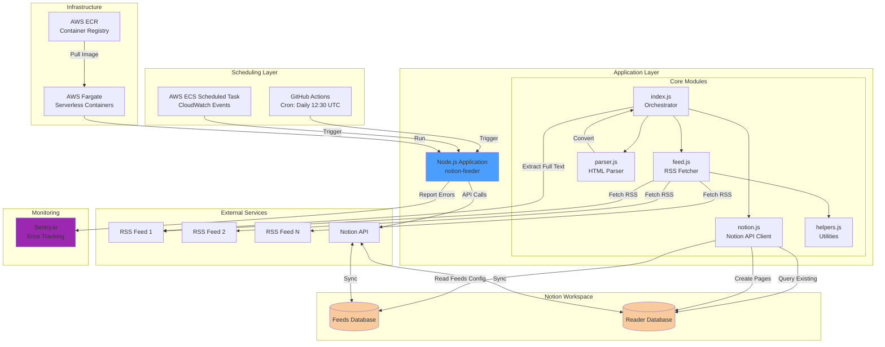
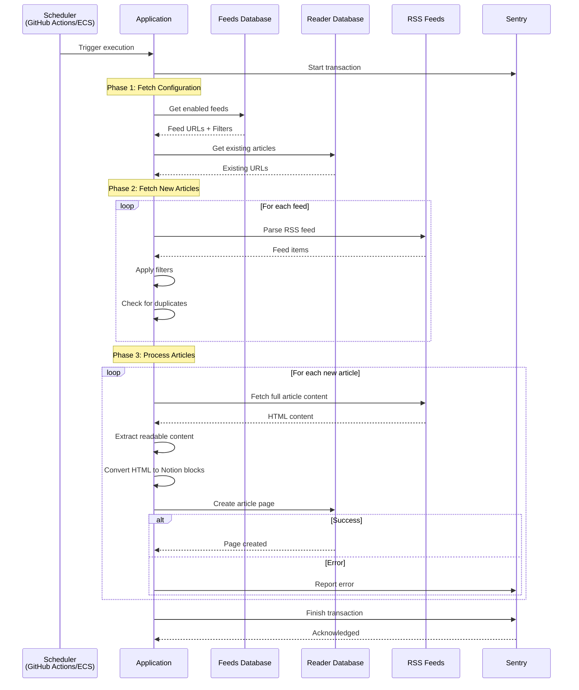
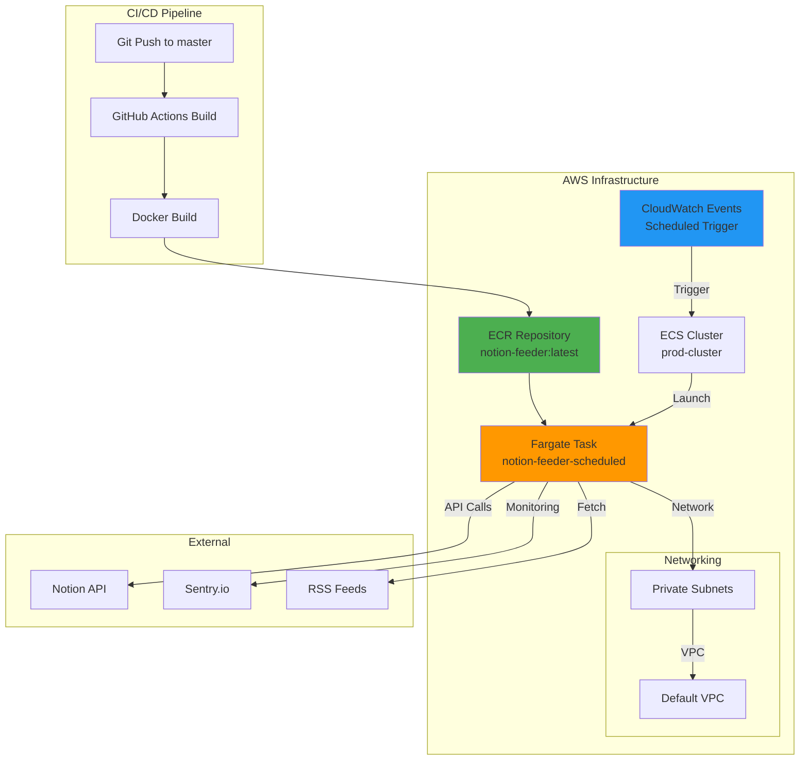

# Notion-Feeder: System Architecture & Use Cases

## Overview

**Notion-Feeder** is an automated RSS feed reader that integrates with Notion. It fetches articles from RSS feeds, processes their content, and creates organized pages in a Notion database. The system runs as a scheduled job on AWS infrastructure, making it easy to maintain a curated reading list in Notion.

## Use Cases

### Primary Use Case: Automated Content Aggregation
**Target Users**: Knowledge workers, researchers, content curators, and avid readers who use Notion for information management.

**Problem Solved**: Manually adding articles from multiple RSS feeds to Notion is time-consuming and repetitive.

**Solution**: Notion-Feeder automatically:
1. Monitors RSS feeds configured in a Notion database
2. Fetches new articles based on customizable filters
3. Extracts full article content (not just summaries)
4. Converts HTML to Notion-compatible blocks
5. Creates properly formatted pages in a reading database

### Key Features

#### 1. **Smart Filtering**
- Configure regex-based filters per feed to capture only relevant articles
- Filter by title, content, or other feed fields
- Example: Only fetch security-related articles from a tech blog

#### 2. **Full-Text Extraction**
- Fetches complete article content from source URLs
- Falls back to RSS feed content if full-text extraction fails
- Converts HTML to clean, readable Notion blocks

#### 3. **Duplicate Detection**
- Tracks existing articles to prevent duplicates
- Compares URLs across all feeds

#### 4. **Automatic Cleanup**
- Archives unread articles older than 30 days
- Prevents reading list from becoming overwhelming

#### 5. **Customizable Backfill**
- Configure how many days back to fetch articles
- Limit number of articles per feed to control volume

## System Architecture

### Architecture Overview



### Component Details

#### 1. **Entry Point: `index.js`**
**Responsibility**: Main orchestrator and workflow coordinator

**Key Functions**:
- `index()`: Main execution function
  - Fetches new feed items
  - Processes each article sequentially
  - Extracts full-text content
  - Converts to Notion blocks
  - Creates Notion pages
- `getItemContent()`: Fetches full article content from URL
- `getRedableContent()`: Extracts readable content using node-readability

**Dependencies**:
- `got`: HTTP client for fetching articles
- `node-readability`: Content extraction
- `@sentry/node`: Error tracking
- `@sentry/tracing`: Performance monitoring

**Error Handling**:
- Graceful fallback when full-text extraction fails
- Sentry integration for error tracking
- Transaction-based tracing for performance monitoring

---

#### 2. **Feed Management: `feed.js`**
**Responsibility**: RSS feed fetching and filtering

**Key Functions**:
- `getNewFeedItems()`: Main function to fetch new articles
  1. Retrieves existing articles from Notion
  2. Fetches feed URLs from Notion feeds database
  3. Parses each RSS feed
  4. Applies filters
  5. Removes duplicates
  6. Returns sorted list of new articles

- `getNewFeedArticlesFrom()`: Fetches articles from a single feed
  - Filters by date (backfill period)
  - Limits results per feed
  
- `matchFeedFilter()`: Applies regex filters to articles
  - Supports multiple filter criteria
  - Returns true if any filter matches

**Configuration**:
- `NOTION_FEEDER_MAX_ITEMS`: Max articles per feed
- `NOTION_FEEDER_BACKFILL_DAYS`: Days to look back for articles

**Dependencies**:
- `rss-parser`: RSS/Atom feed parsing
- Custom filter system using regex patterns

---

#### 3. **Notion Integration: `notion.js`**
**Responsibility**: All interactions with Notion API

**Key Functions**:

- `getFeedUrlsFromNotion()`: Retrieves enabled feeds from Feeds database
  - Queries feeds with `Enabled=true`
  - Extracts feed URLs and filters
  
- `getExistingArticles()`: Fetches all articles from Reader database
  - Handles pagination (cursor-based)
  - Returns array of {title, url} objects
  
- `addFeedItemToNotion()`: Creates article page in Reader database
  - Sanitizes content (removes undefined elements)
  - Handles Notion API limitations:
    - Max 100 blocks per request
    - Max 2000 chars per text block
    - Chunks content across multiple API calls
  - Sets page properties (Title, Link)
  - Appends content as child blocks

- `getFeedItemFilter()`: Parses filter JSON from feed configuration
  - Validates filter structure
  - Converts regex patterns to RegExp objects
  
- `deleteOldUnreadFeedItemsFromNotion()`: Archives old unread articles
  - Queries items older than 30 days and unread
  - Archives matching pages

**Data Transformations**:
- `compressParagraphLineNumber()`: Truncates paragraphs exceeding 95 lines
- `truncateParagraph()`: Ensures text blocks don't exceed 2000 chars
- `isParagraphUndefined()`: Filters out malformed paragraphs

**Constants**:
- `MAX_PARAGRAPH_LENGTH = 95`: Notion limit for paragraph blocks

**Environment Variables**:
- `NOTION_API_TOKEN`: Authentication token
- `NOTION_READER_DATABASE_ID`: Target database for articles
- `NOTION_FEEDS_DATABASE_ID`: Database storing feed configurations

---

#### 4. **Content Parsing: `parser.js`**
**Responsibility**: HTML to Notion block conversion

**Key Functions**:
- `htmlToNotionBlocks()`: Converts HTML to Notion block structure
  1. Converts HTML to Markdown
  2. Fixes invalid links
  3. Converts Markdown to Notion blocks

- `htmlToMarkdown()`: HTML to Markdown conversion
  - Uses Turndown library
  - Applies transformations to fix Notion API quirks
  
- `fixRemoveInvalidLinks()`: Removes anchor-only links
  - Notion API doesn't support internal links (e.g., `#heading`)
  - Recursively removes these patterns

**Dependencies**:
- `turndown`: HTML to Markdown converter
- `@tryfabric/martian`: Markdown to Notion blocks converter

---

#### 5. **Utilities: `helpers.js`**
**Responsibility**: Helper functions

**Key Functions**:
- `timeDifference()`: Calculates time difference between dates
  - Returns differences in days, hours, minutes, seconds
  - Used for date-based filtering

---

### Data Flow



### Deployment Architecture

#### Production Deployment (AWS)



**Infrastructure Components**:

1. **AWS ECS (Elastic Container Service)**
   - Cluster: `prod-cluster`
   - Capacity Providers: `FARGATE_SPOT` (primary), `FARGATE`
   - Cost optimization: Uses spot instances

2. **AWS ECR (Elastic Container Registry)**
   - Repository: `notion-feeder`
   - Image tag: `latest`
   - Image scanning: Disabled
   - Tag mutability: Immutable

3. **AWS Fargate**
   - Task Name: `notion-feeder-scheduled`
   - CPU: 256 units (0.25 vCPU)
   - Memory: 512 MB
   - Networking: Private subnets, no public IP

4. **Terraform Configuration**
   - State backend: S3 (`mikec-prod-tf-states`)
   - Region: `us-west-2`
   - VPC: Default VPC
   - Managed via terraform module: `umotif-public/ecs-fargate/aws`

#### Development Deployment (GitHub Actions)

**Scheduled Execution**:
- Cron: `30 12 * * *` (Daily at 12:30 PM UTC / 6:00 PM IST)
- Manual trigger: workflow_dispatch

**Build Process**:
1. Checkout repository
2. Setup Node.js 14
3. Install dependencies (cached)
4. Build production bundle (`npm run build-prod`)
5. Upload `dist` artifacts

**Release Process** (on push to master):
1. Build project using webpack
2. Commit bundled code to `build` branch
3. Trigger AWS deployment (manual)

---

### Technology Stack

#### Runtime
- **Platform**: Node.js 14.x (Alpine Linux for containers)
- **Package Manager**: npm 6.x

#### Core Dependencies
| Package              | Purpose                                 |
| -------------------- | --------------------------------------- |
| `@notionhq/client`   | Official Notion API client              |
| `rss-parser`         | Parse RSS/Atom feeds                    |
| `node-readability`   | Extract readable content from web pages |
| `turndown`           | Convert HTML to Markdown                |
| `@tryfabric/martian` | Convert Markdown to Notion blocks       |
| `got`                | HTTP client for fetching articles       |
| `@sentry/node`       | Error tracking and monitoring           |
| `dotenv`             | Environment configuration               |

#### Development Tools
- **Bundler**: Webpack 5
- **Transpiler**: Babel (ES6+ support)
- **Linter**: ESLint (Airbnb config)
- **Formatter**: Prettier

#### Infrastructure
- **Containerization**: Docker (multi-stage builds)
- **Orchestration**: AWS ECS + Fargate
- **IaC**: Terraform
- **CI/CD**: GitHub Actions
- **Registry**: AWS ECR
- **Monitoring**: Sentry.io

---

## Configuration

### Environment Variables

```bash
# Notion API Configuration
NOTION_API_TOKEN=             # Notion integration token
NOTION_READER_DATABASE_ID=    # Database for storing articles
NOTION_FEEDS_DATABASE_ID=     # Database for feed configurations

# Application Settings
NOTION_FEEDER_MAX_ITEMS=      # Max articles per feed (optional)
NOTION_FEEDER_BACKFILL_DAYS=  # Days to look back (optional)

# Monitoring
SENTRY_DSN=                   # Sentry error tracking DSN
SENTRY_SAMPLING_RATE=         # Sample rate for traces (0.0-1.0)
NODE_ENVIRONMENT=             # 'prod' or 'dev'
```

### Notion Database Schema

#### Feeds Database
| Property | Type      | Description                |
| -------- | --------- | -------------------------- |
| Title    | Title     | Feed name                  |
| Link     | URL       | RSS feed URL               |
| Enabled  | Checkbox  | Whether to fetch this feed |
| Filter   | Rich Text | JSON array of filter rules |

**Filter Format**:
```json
[
  {
    "field": "title",
    "pattern": "(security|privacy|auth)"
  },
  {
    "field": "content",
    "pattern": "react|vue|angular"
  }
]
```

#### Reader Database
| Property   | Type         | Description    |
| ---------- | ------------ | -------------- |
| Title      | Title        | Article title  |
| Link       | URL          | Article URL    |
| Read       | Checkbox     | Reading status |
| Created At | Created time | Auto-populated |

---

## Error Handling & Monitoring

### Error Handling Strategy

1. **Network Errors**: Graceful fallback to RSS content if full-text fetch fails
2. **Parsing Errors**: Skip malformed articles, log to console
3. **Notion API Errors**: 
   - Report to Sentry
   - Continue processing remaining articles
4. **Content Truncation**: Automatic handling of Notion API limits

### Monitoring

**Sentry Integration**:
- Transaction tracking for performance monitoring
- Error capture for failed operations
- Custom spans for each major operation:
  - `getExistingArticles`: Fetch existing articles
  - `getFeedUrls`: Fetch feed configurations
  - `getArticleListFromFeedUrl`: Parse RSS feed
  - `getNewFeedItems`: Extract full-text content
  - `addFeedItemToNotion`: Create Notion page

**Sampling Rates**:
- Production: 20% (configurable)
- Development: 100%

---

## Scalability Considerations

### Current Limitations
1. **Sequential Processing**: Articles processed one at a time
2. **Notion API Rate Limits**: 3 requests per second
3. **Memory**: Limited to 512 MB in Fargate
4. **Content Size**: Max 95 blocks per initial page create

### Potential Improvements
1. **Parallelization**: Process multiple articles concurrently
2. **Batch Processing**: Group Notion API calls
3. **Caching**: Cache feed parsing results
4. **Database Pagination**: More efficient duplicate detection
5. **Content Streaming**: Handle very large articles

---

## Security

### API Keys
- Stored as GitHub Secrets (CI/CD deployment)
- Stored as environment variables (AWS deployment)
- Never committed to repository

### Network
- Fargate tasks run in private subnets
- No public IP assignment
- Outbound traffic only to:
  - Notion API
  - RSS feed sources
  - Sentry

### Container Security
- Base image: `mhart/alpine-node` (minimal attack surface)
- Multi-stage build (no dev dependencies in production)
- Immutable image tags in ECR

---

## Development Workflow

### Local Development
```bash
# Clone repository
git clone https://github.com/ravgeetdhillon/notion-feeder.git
cd notion-feeder

# Install dependencies
npm install

# Configure environment
cp .env.example .env
# Edit .env with your credentials

# Development mode (watch for changes)
npm run develop

# Run manually
npm run feed
```

### Build & Deploy
```bash
# Build production bundle
npm run build-prod

# Build Docker image
npm run container-build

# Push to ECR
npm run ecr-push

# Deploy to ECS (requires ecs-deploy CLI)
npm run ecr-deploy
```

### Testing
Currently, the project does not have automated tests. Recommended testing approach:
1. Manual testing with sample feeds
2. Monitor Sentry for production errors
3. Review Notion pages for content quality

---

## Future Enhancements

### Planned Features
1. **Webhooks**: Real-time feed updates instead of scheduled polling
2. **AI Summarization**: Auto-generate article summaries
3. **Tag Extraction**: Automatic tagging based on content
4. **Read Status Sync**: Track reading progress
5. **Multi-workspace Support**: Support multiple Notion workspaces
6. **Web UI**: Dashboard for managing feeds and filters

### Technical Improvements
1. **Unit Tests**: Add comprehensive test coverage
2. **Integration Tests**: Test Notion API interactions
3. **TypeScript**: Migrate to TypeScript for better type safety
4. **Error Recovery**: Implement retry logic with exponential backoff
5. **Metrics Dashboard**: CloudWatch metrics for monitoring

---

## Conclusion

Notion-Feeder provides a robust, automated solution for RSS feed aggregation into Notion. Its architecture emphasizes reliability, cost-efficiency, and ease of deployment. The system handles content extraction, filtering, and formatting automatically, enabling users to maintain a curated reading list without manual intervention.

The serverless architecture using AWS Fargate ensures minimal operational overhead while maintaining flexibility for future enhancements. Integration with Sentry provides visibility into system health and performance.
